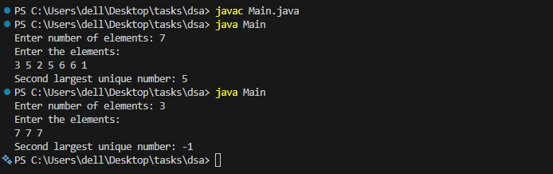

## DSA - Second Largest Unique Number Finder

Java program that finds the second largest unique number from an array.

**What it does:**
- Takes user input for array elements
- Finds the second largest unique number (ignores duplicates)
- Returns -1 if there's no second largest number

**How to run:**
```bash
cd dsa
javac Main.java
java Main
```

**Example output:**



---

## Todo App(Backend)

A basic todo application with Node.js backend and vanilla JS frontend.

**Setup:**
```bash
cd backend
npm install
npm start
```

Then open `index.html` in your browser.

**API Endpoints:**
- `GET /todos` - Get all todos
- `POST /todos` - Create todo
- `PUT /todos/:id` - Update todo
- `DELETE /todos/:id` - Delete todo

**Tech used:**
- Backend: Node.js, Express
- Frontend: HTML, CSS, JavaScript
- Storage: JSON file
